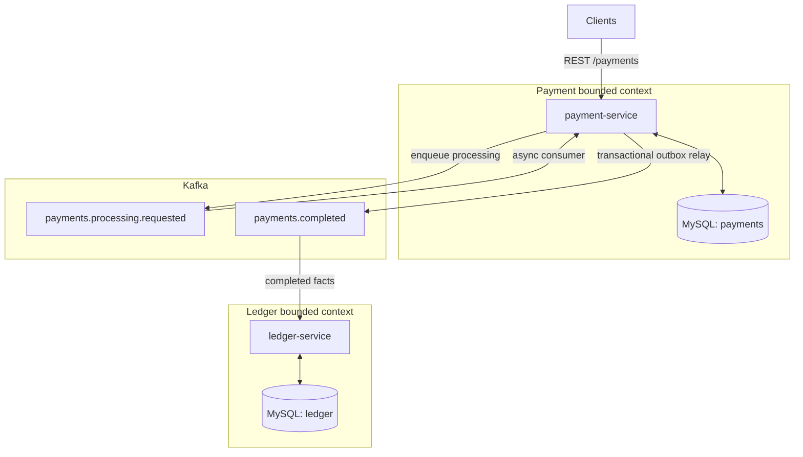

# Payments project

Practice repo: two Spring Boot services that model a **payment API**, **asynchronous processing over Kafka**, a **transactional outbox** for reliable publishing, and a **ledger** consumer that reacts to completed payments. Useful for internal drills and as a concise portfolio / interview talking point.

## Architecture



**Diagram notes:** Kafka delivery is **at-least-once**; the app uses **idempotency** and explicit state (outbox, applied events on the ledger). **DLT** topics exist for poison messages (`*.DLT`); see each service `application.yml`. Topic names match `payment.kafka.*` and `ledger.kafka.*`.

### Narrative (same picture in words)

1. **Payment API** persists state and drives async work (processing requested → consumer → completion).
2. **Transactional outbox** in the payment service keeps “DB commit” and “event to publish” consistent; a scheduler **relays** outbox rows to Kafka.
3. **Topics** (defaults in `application.yml`) include processing requests, a **completed** stream for the ledger, and **DLT** companions for poison messages.
4. **Ledger service** subscribes to completed-payment facts and updates its own database idempotently where modeled.
5. **Recovery**: configurable threshold moves stuck `PROCESSING` work back toward retry (see `payment.processing` in payment-service config).

For interview-style narration: **at-least-once delivery**, **idempotency** at the HTTP layer, **outbox vs dual-write**, and **separate bounded contexts** (payments vs ledger) with an explicit integration event.

## What is here

| Module | Role |
|--------|------|
| **payment-service** | REST API, MySQL + Flyway, Kafka producer/consumer, outbox relay, stuck-processing recovery, Actuator + Prometheus |
| **ledger-service** | Consumes payment-completed events, applies ledger postings (separate DB) |
| **common** | Shared Java module (minimal for now) |

Infrastructure for local development lives in **`docker-compose.yml`** (MySQL 8, single-node Kafka in KRaft mode).

## Requirements

- **JDK 17** (matches [CI](.github/workflows/ci.yml))
- **Docker** (recommended for MySQL + Kafka)

## Quick start

1. **Start dependencies** (from repo root):

   ```bash
   docker compose up -d
   ```

   This exposes MySQL on **3306** and Kafka on **9092**, aligned with the default `application.yml` settings.

2. **Run the apps** (two processes). Both default to **port 8080**, so start one of them on another port, for example:

   ```bash
   ./gradlew :payment-service:bootRun
   ```

   ```bash
   SERVER_PORT=8081 ./gradlew :ledger-service:bootRun
   ```

   The payment service expects database **`payments`** (created by compose). The ledger service uses **`ledger`** with `createDatabaseIfNotExist=true` in its JDBC URL so it can create that schema on first connect.

3. **Default credentials** (local only): MySQL user `root`, password `root`, as in each service’s `application.yml`. Change these for anything beyond local practice.

## HTTP API (payment-service)

Base path: `/payments`

| Method | Path | Notes |
|--------|------|--------|
| `POST` | `/payments` | Requires header **`Idempotency-Key`**. Body: JSON with `amount` (positive number) and `currency` (3-letter ISO 4217, uppercase, e.g. `USD`). Returns `201 Created` with `Location` of the new resource. |
| `GET` | `/payments/{id}` | Payment details, or `404` if missing. |
| `GET` | `/payments/health` | Simple JSON `{ "status": "UP" }` (in addition to Spring Actuator). |

Example:

```bash
curl -sS -X POST http://localhost:8080/payments \
  -H 'Content-Type: application/json' \
  -H 'Idempotency-Key: demo-key-1' \
  -d '{"amount": 12.34, "currency": "USD"}'
```

## Configuration

- Payment: `payment-service/src/main/resources/application.yml` — datasource, Kafka, outbox relay, stuck processing, Actuator, Kafka-backed readiness.
- Ledger: `ledger-service/src/main/resources/application.yml` — datasource, Kafka consumer, topics.

Prefer environment-specific overrides or env vars for anything beyond local practice (never ship default passwords).

## Tests and CI

```bash
./gradlew test
```

GitHub Actions runs the same on pushes and pull requests to `main` / `master` (Temurin 17, Gradle, tests; failed runs upload `**/build/reports/tests/` as an artifact).

## Observability

- **Actuator**: health (including liveness/readiness where enabled), metrics, Prometheus scrape endpoint on the payment service; ledger exposes health, info, and Prometheus per its configuration.

## Repository layout

```
payment-service/   # API + payment domain
ledger-service/  # Ledger projections / consumers
common/            # Shared code
gradle/            # Wrapper
docker-compose.yml
```

## Disclaimer

This is a **learning and practice** codebase: simplified security, single-broker Kafka, and checked-in local defaults. It is not a copy-paste production blueprint without hardening, secrets management, and operational runbooks.
